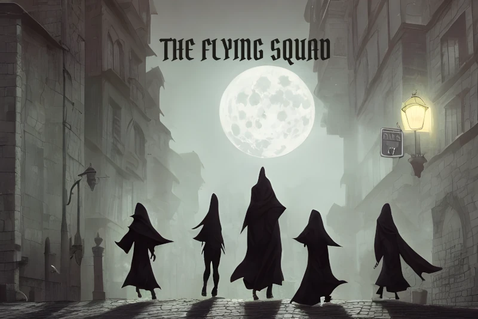

**WANTED:**

WIZARDS, WARLOCKS, SORCERERS, CLERICS, DRUIDS, MONKS, BARDS, PALADINS, FIGHTERS, RANGERS and, lamentably, ROGUES of *impeccable* character to assist the city watch with the investigation of crimes.

Apply to Capt. Larkspur at the Palace

**BARBARIANS NEED NOT APPLY!**

# A Free Adventure Module for D&D 5e and Foundry VTT

The Flying Squad is an elite unit of the city watch. It is recruiting experienced
(level 5) officers. The adventures use standard races and monsters, and can be used in any standard D&D world, such as Faerûn in the Forgotten Realms.

All the adventures are contained in the Foundry Journal, with inline macro shortcuts to open scenes, stop and start audio, roll dice, display images to players, open character sheets, etc.

This module imports a series of adventures from the Compendium. You can import them one at a time as needed to save space and loading times, or all at once.

The module includes:

* The Flying Squad backgrounder, including maps of the Flying Squad station,
	the associated Temple of Truth and Justice and the courthouse.
* Eight example officers.
* Ten interlinked cases to solve, including full case descriptions, NPCs, magic items and more than two dozen maps.
* Seven new character backgrounds suitable for law enforcement.
* Hundreds of character, NPC and monster tokens.
* Music for some scenes, other mood-setting orchestral cues included.

Requirements: Foundry Version 10.291 or greater and DnD5e - Fifth Edition System 2.1.5 or greater.

## Brief Installation Instructions for Foundry Experts

* Install the Flying Squad module from https://raw.githubusercontent.com/flyingsquad/flying-squad/main/module.json
* Enable the Flying Squad module in your world.
* Import Adventures from the Flying Squad Adventure Compendium.
* Open the Flying Squad Journal entry.

## Detailed Installation Instructions

If the above instructions are a little too brief, these are more detailed.

### Install the Flying Squad Module

* Go to the Configuration and Setup page for your Foundry server.
* Click Add-on Modules.
* Click the Install Module button at the bottom left.
* Copy the manifest URL below and paste it in the Manifest URL edit box at the bottom of the Install Module dialog:

    https://raw.githubusercontent.com/flyingsquad/flying-squad/main/module.json

* Click the Install button at the bottom right of the Install Module dialog.
* Foundry will show a progress bar as it downloads and installs the module.
* Click the Close button in the upper right corner of the Install Module dialog.

### Enable the Flying Squad Module in Your World

Once you have installed the Flying Squad module you need to enable the Flying Squad module:

* On the Foundry Virtual Tabletop Configuration and Setup page click Game Worlds.
* Click the Launch World button for the world where you want to install the Flying Squad adventures.
* On the Join Game Session page Select the Gamemaster user and enter your password.
* Click Join Game Session
* Click the Game Setting icon in the sidebar at the upper corner of the window (the two gears).
* Click the Manage Modules button under Game Settings.
* In the Module Management window scroll down until you find The Flying Squad module.
* Click the checkbox.
* Click Save Module Settings at the bottom of the Module Management window.
* The Foundry application will ask if it is okay to reload. Click Yes.

### Import the Flying Squad Adventures from the Compendium

**Note:** If you're running V11 of Foundry VTT it may take a few minutes for the server to convert the Flying Squad database, so it may not appear immediately after you enable it.

* Click the Compendium Packs icon at the top of the sidebar, just to the left of the two gears.
* Depending on what modules you have installed and what version of Foundry VTT you are running, the Flying Squad Adventure will be in either the Default compendium folder or the Adventure folder, or listed separately. 
* Click Flying Squad Adventure. The Flying Squad Adventure window will open.
* Click The Flying Squad entry at the top of the window.
* The adventure window will open.
* Click the Import Adventure button at the bottom of the window.
* Flying Squad entries will be added to the Scenes, Actors, Items, Journal and Playlists tabs of the sidebar.
* Open the Journal tab in the sidebar and click the Flying Squad folder, then click The Flying Squad journal entry.
* Install the adventures, starting with The Case of the Butchered Butcher, as needed.
